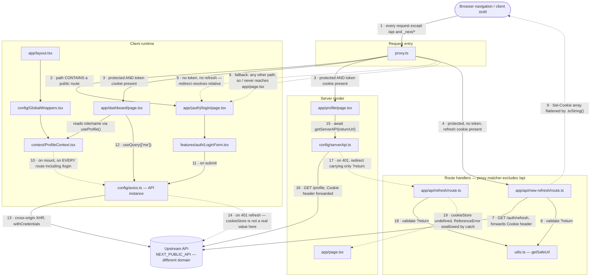

@AGENTS.md

# Auth architecture & conventions

Reference for the login / session / RBAC work. Decisions recorded 2026-08-21.
Read this before touching [src/proxy.ts](src/proxy.ts), [src/config/axios.ts](src/config/axios.ts),
[src/config/serverApi.ts](src/config/serverApi.ts), or anything under [src/app/api/](src/app/api/).

## Wiring as built today

Nodes are files, edges are "what calls what, and when". **Dashed edges are the known-broken paths** —
each maps to an entry in [Outstanding work](#outstanding-work). This is the *current* state; the
target shape is in [Decision: same-origin BFF](#decision-same-origin-bff-and-the-bff-owns-cookies).



| File | One-liner |
|---|---|
| [proxy.ts](src/proxy.ts) | Runs before every non-`/api` request; presence-checks the access cookie and redirects to login or refresh. Optimistic pre-filter only — it also runs on prefetches. |
| [app/api/new-refresh/route.ts](src/app/api/new-refresh/route.ts) | Refresh endpoint the **proxy** redirects to; calls upstream with the forwarded cookies and re-emits `Set-Cookie` on our origin. |
| [app/api/refresh/route.ts](src/app/api/refresh/route.ts) | Refresh endpoint **SSR** redirects to. Same job as `new-refresh` — the duplication is the bug, not the design. |
| [utils.ts](src/utils.ts) | `getSafeUrl` — the return-URL validator both handlers call before redirecting. |
| [app/profile/page.tsx](src/app/profile/page.tsx) | Server Component; fetches the profile during render and cannot set cookies, so it delegates refresh by redirecting. |
| [config/serverApi.ts](src/config/serverApi.ts) | Per-request axios for server rendering; forwards the incoming `Cookie` header and turns a 401 into a redirect. |
| [app/page.tsx](src/app/page.tsx) | Home. Currently unreachable — the proxy's fallback redirects `/` to login. |
| [app/layout.tsx](src/app/layout.tsx) | Root layout; mounts the global providers around every route, public ones included. |
| [config/GlobalWrappers.tsx](src/config/GlobalWrappers.tsx) | Client provider stack: React Query client + `ProfileProvider`. |
| [context/ProfileContext.tsx](src/context/ProfileContext.tsx) | Fetches `/profile` on mount and exposes it via `useProfile()`. Intended home for `role` once RBAC lands. |
| [app/(auth)/login/page.tsx](src/app/(auth)/login/page.tsx) | Login route; renders the form inside the `(auth)` layout. |
| [features/auth/LoginForm.tsx](src/features/auth/LoginForm.tsx) | Credential form; posts to the API and pushes to `/profile` on success. |
| [app/dashboard/page.tsx](src/app/dashboard/page.tsx) | Client page; the example of client-side authenticated fetching via React Query. |
| [config/axios.ts](src/config/axios.ts) | Browser axios instance; the single place a mid-session 401 becomes a refresh-and-retry. |
| [config/queryClient.ts](src/config/queryClient.ts) | React Query defaults; already configured to dehydrate pending queries for server prefetch. |
| [constants/routes.ts](src/constants/routes.ts) · [endpoints.ts](src/constants/endpoints.ts) · [global.ts](src/constants/global.ts) | App paths, API paths, and the cookie/param names shared across proxy, handlers, and clients. |

## The constraint everything else follows from

**Server Components cannot set cookies.** From the Next 16 `cookies` docs: _"Setting cookies is
not supported during Server Component rendering. To modify cookies, invoke a Server Function or
use a Route Handler."_ This is a framework constraint, not an oversight to engineer around.

Refresh needs two properties — it must run *before* the request that needs the token, and it must
be able to *write cookies*:

| | runs before | can write cookies |
|---|---|---|
| Proxy | yes, every request | yes (`response.cookies.set()`) |
| Route Handler / Server Action | yes | yes |
| Client interceptor | yes | yes (browser stores backend's `Set-Cookie`) |
| **Server Component** | yes | **no** |

So the division of labour is fixed:

- **Proxy** — proactive. Access cookie missing → refresh, continue the request.
- **Client interceptor** — reactive. 401 mid-session → single-flight refresh → retry.
- **Server Component** — delegate only. 401 → `redirect()` to the refresh Route Handler. Never
  attempt a refresh in place.

Three call sites, but they must share **one** refresh implementation. Three divergent copies is
what produced the original bugs.

## Decision: same-origin BFF, and the BFF owns cookies

The upstream API is on a **different registrable domain**, so its cookies are invisible to the Next
server: `cookies()` only returns cookies scoped to our own domain, and
`request.cookies.get()` in the proxy is permanently `undefined`. Without a BFF, proxy auth checks
and SSR-with-session are not buggy — they are *impossible*.

```
Browser            →  /api/*  (Next origin, BFF)  →  upstream API
Server Components  →  upstream API directly (forwarding the first-party cookie)
```

Server Components must **not** fetch through our own Route Handlers — the docs are explicit that
it costs an extra round trip and fails at build time. Browser through the BFF; server direct.

**The API returns tokens in the JSON body** (`{ accessToken, refreshToken, expiresIn }`) and sets
no cookies itself. The BFF is the only layer that knows cookies exist. We own both sides, so this
is strictly better than catching upstream `Set-Cookie`, because a relayed cookie string is written
for the *API's* domain:

- `Domain=api.…` — a server may only set cookies for its own domain or a parent, so the browser
  **silently rejects** it. If upstream happens to omit `Domain` it appears to work, and breaks the
  day someone adds one.
- `SameSite=None` — the cross-site workaround we are escaping; we want `Lax`.
- `Secure` — fine in prod and on localhost, breaks on plain-HTTP non-localhost environments.

Relaying only to override most of the attributes is pointless. Set them ourselves:

```ts
res.cookies.set(ACCESS_TOKEN, accessToken, {
  httpOnly: true,
  secure: process.env.NODE_ENV === 'production',
  sameSite: 'lax',
  path: '/',
  maxAge: expiresIn,   // cookie lifetime == token lifetime; see below
});
```

Consequences to carry through:

- **`NEXT_PUBLIC_API` becomes `API_BASE_URL`** (server-only). The browser never needs the upstream
  URL, so it leaves the JS bundle and can't be accidentally re-pointed at cross-site.
- Client axios `baseURL` becomes `/api`; `withCredentials` stops being load-bearing (same-origin
  requests send cookies anyway).
- `serverApi` keeps pointing at the upstream API and forwarding cookies — the API parses the
  `Cookie` header by name and doesn't care what domain scoped it.

If the API ever must set cookies itself, relay via `getSetCookie()` → parse → re-set with **our**
attributes, allowlisted to `token` / `refresh_token`. Never pass the raw string through.

### Cookie lifetime is a contract

The proxy does a **presence** check on the access cookie — an "optimistic check" in Next's terms,
correct given it also runs on prefetches. It is only *meaningful* if cookie `Max-Age` matches token
`exp`. If the cookie outlives the token, the proxy waves through requests that then 401 in SSR.
`maxAge: expiresIn` in the BFF **is** that guarantee. Do not break it.

## Security invariants

1. **No secrets in URLs.** Browser history, our access logs, any CDN log, and the `Referer` of the
   next request all capture them. Redirects carry *intent* (`?return=/profile`), never credentials.
   The destination already holds the refresh cookie — it does not need to be handed anything.
2. **Authority for a session operation is the refresh cookie**, never a query param, body field, or
   header the caller controls. Ask of every handler: who can call this, and what proves they may?
3. **Validate every return/redirect param.** `new URL(input, base)` uses `base` *only if `input` is
   relative* — an absolute or protocol-relative input wins outright. Use the origin-comparison
   validator in [src/utils.ts](src/utils.ts) (below), not string prefix checks.
4. **Never log tokens, and never log an `AxiosError` whole.** `err.config.headers` contains the
   `Cookie` header. Log `err.response?.status` and `err.config?.url`.
5. **Route Handlers and Server Functions own their own auth.** The proxy matcher excludes `api`,
   and per the docs Server Functions are POSTs to the route where they're defined, so _"a matcher
   change or a refactor that moves a Server Function to a different route can silently remove Proxy
   coverage."_ The proxy is a pre-filter, never the only check.
6. **The BFF is not an open relay.** A catch-all `/api/[...slug]` → `${API_BASE_URL}/${slug}` reaches
   any upstream path, including internal endpoints — SSRF-shaped if upstream is on a private network.
   Reject `..`, allowlist path prefixes. Note the BFF docs' own example has the same footgun as (3):
   an absolute `slug` escapes the base entirely.
7. **CSRF is ours now that cookies are first-party.** `SameSite=Lax` covers the cross-site form POST
   but *does* send on top-level cross-site GET. Keep mutations off GET, and check
   `Origin` / `Sec-Fetch-Site` on mutating BFF routes.
   Do **not** use `SameSite=Strict` for the refresh token — it is withheld on cross-site top-level
   navigation, so a user arriving from an email link cannot be refreshed and gets logged out.
8. **`Set-Cookie` is the one header that must never be joined.** HTTP allows it to repeat, and cookie
   `Expires` values contain commas, so a comma-joined header is genuinely ambiguous. Write with
   `headers.append('set-cookie', c)` per value (or `cookies.set()`); read with `getSetCookie()`,
   never `get()`. The failure mode is silent: refresh looks successful, no cookie is stored, the
   proxy bounces back to refresh, and the user sees `ERR_TOO_MANY_REDIRECTS`.

## Code patterns

**Axios error interceptors must reject by default.** An error interceptor is the `onRejected` of
`.then(onFulfilled, onRejected)` — returning normally means *"I recovered, here is the value"*, so
falling off the end resolves the request with `undefined`. Write it reject-first:

```ts
async (err: AxiosError) => {
  if (err.response?.status !== 401) return Promise.reject(err);
  if (err.config?._retry) return Promise.reject(err);
  try {
    await refreshOnce();
  } catch {
    return Promise.reject(err);
  }
  err.config._retry = true;
  return API(err.config);
}
```

Every branch either returns a request or rejects. Never `return err` — that resolves the caller
with an error object as its data.

**Single-flight the refresh.** With rotating refresh tokens, concurrent refreshes actively harm:
several fail and one may invalidate the token another just minted.

```ts
let inFlight: Promise<void> | null = null;
export function refreshOnce() {
  inFlight ??= doRefresh().finally(() => { inFlight = null; });
  return inFlight;
}
```

Pair with the `_retry` flag above and `retry: false` for auth failures in React Query — the default
`retry: 3` in [src/config/queryClient.ts](src/config/queryClient.ts) otherwise multiplies every
attempt by four.

**Annotate Route Handler return types.** `NextResponse.redirect()` is pure — it builds a Response,
it performs nothing — so a missing `return` is silent, and lint cannot catch a call used as an
expression statement. The compiler can, given `strict: true`:

```ts
export async function GET(req: NextRequest): Promise<NextResponse> {
```

Any path that falls through then raises `TS2366: Function lacks ending return statement`. Do this on
every handler as policy.

**Return-URL validator.** Let the URL parser normalize, then compare origins — it handles
`https://evil.com`, `//evil.com`, and `/\evil.com` (WHATWG treats `\` as `/`) in one check:

```ts
const SENTINEL = 'http://x.invalid';
export function getSafeUrl(url: string | null) {
  if (!url) return routes.home;
  try {
    const parsed = new URL(url, SENTINEL);
    if (parsed.origin !== SENTINEL) return routes.home;  // absolute or protocol-relative
    return parsed.pathname + parsed.search;
  } catch {
    return routes.home;
  }
}
```

Keep a unit test over `['/profile', '/dashboard', '//evil.com', 'https://evil.com', '/\\evil.com',
'/a//b']`. Inverted logic in a function like this reads perfectly fine on the page — it needs a test,
not a careful re-read.

**Always absolute paths, always from [src/constants/routes.ts](src/constants/routes.ts).**
`new URL('login', request.url)` and `redirect('login')` resolve against the *current path* — from
`/dashboard/settings` you get `/dashboard/login`. Inline route strings are where this bug lives.
`encodeURIComponent` anything interpolated into a query string.

**Match routes exactly, never by substring.** `path.includes('/reset-password')` treats
`/dashboard/reset-password` as public — a real auth bypass for any future route whose path contains a
public route's name. Use exact match or segment-boundary `startsWith`, and evaluate protected
before public.

**Providers that fetch belong at the narrowest scope where their data is guaranteed to exist.**
[ProfileProvider](src/config/GlobalWrappers.tsx) in the root layout also runs on `/login`, where a
401 is *expected*; treating it as a dead session produces an infinite reload once the interceptor's
redirect works. Move it into an authenticated layout, or gate it (`enabled`, `retry: false`).

**One source of truth for `/profile`.** [queryClient.ts](src/config/queryClient.ts) already
configures `shouldDehydrateQuery` to include pending queries, so finish that path: prefetch on the
server, ship through `HydrationBoundary`, let the client context read a warm cache. Wrap server-side
reads in React `cache()` so two components asking for the profile in one render make one call
(`axios` on the server bypasses Next's `fetch` dedupe).

## RBAC — planned approach

**Do not put the check in a layout, and do not put it in a client hook.** The Next 16 docs rule this
out on two independent grounds:

> _"Due to Partial Rendering, be cautious when doing checks in Layouts as these don't re-render on
> navigation, meaning the user session won't be checked on every route change."_
>
> _"A layout also does not control whether the rest of the route renders. Route segments and parallel
> route slots are rendered by the router, so a layout that hides or swaps them does not stop them
> from running or from appearing in the RSC Payload."_

So a layout check misses client navigations *and* does not stop the protected page from executing and
shipping its data. A client hook is weaker still — it runs after the payload is already on the wire.

What actually holds, in order of importance:

1. **A server-side DAL** — `verifySession()` / `requireRole()` wrapped in React `cache()`, called by
   whatever *reads the data*. Per the docs this _"guarantees that wherever `getUser()` is called, the
   auth check is performed, and prevents developers from forgetting."_ This is the load-bearing layer.
2. **Per-page checks in route groups** — `app/(admin)/**/page.tsx` each `await requireRole('admin')`.
   Still explicit and manual, but at the segment that actually renders.
3. **`forbidden()` / `unauthorized()`** for the UI, behind `experimental.authInterrupts` in
   [next.config.ts](next.config.ts), with `forbidden.tsx` / `unauthorized.tsx`. Caveats: cannot be
   called in the root layout, and a `try/catch` around the call swallows it — needs
   `unstable_rethrow`.
4. **A client hook for hiding UI only.** [ProfileContext](src/context/ProfileContext.tsx) carrying
   `role` is the right home for optimistic show/hide. It must never be the only thing between a user
   and the data.
5. **Proxy for coarse pre-filtering only** — cookie-shaped checks, no role lookups (it runs on
   prefetches too).

## Repo-specific gotchas

- **`"lib": ["dom"]` in [tsconfig.json](tsconfig.json) puts browser globals in scope in server
  files.** `cookieStore` (i.e. `window.cookieStore`, the Cookie Store API) therefore typechecks
  anywhere, including Route Handlers and Server Components, where it is `undefined` at runtime →
  `ReferenceError`. TypeScript will never flag this. Two live instances exist; see below.
- **Dev hides the cross-origin cookie problem entirely.** Cookies are scoped by *site* and ignore
  ports, so `localhost:7777` and `localhost:3000` share one jar. Local testing always exercises the
  same-site case regardless of what production looks like.
- **`endPoints.auth.refresh` is the only endpoint without a leading slash**
  ([src/constants/endpoints.ts](src/constants/endpoints.ts)). String-concatenated URLs work *only*
  because the API base has a trailing slash — two inconsistencies cancelling out. Normalize both.
- Route Handlers are not covered by the proxy matcher (`api` is excluded). Intentional — we don't
  want redirect logic on XHR — but it means each handler carries its own checks.

## Outstanding work

Security:
- [ ] `getSafeUrl` in [src/utils.ts](src/utils.ts) is **inverted** — returns the URL when it detects
      danger, `routes.home` when safe. Open redirect is live via
      [api/new-refresh](src/app/api/new-refresh/route.ts) (the path the proxy uses) and latent in
      [api/refresh](src/app/api/refresh/route.ts). Replace with the validator above + tests.
- [ ] `console.log(err)` in [api/new-refresh](src/app/api/new-refresh/route.ts) logs both tokens via
      `err.config.headers`.
- [ ] Substring route matching in [proxy.ts](src/proxy.ts) — auth bypass for
      `/dashboard/reset-password`, `/profile/login`, etc.
- [ ] Unencoded `return` interpolation in [proxy.ts](src/proxy.ts) and
      [serverApi.ts](src/config/serverApi.ts).

Correctness:
- [ ] `cookieStore` referenced but never defined in [api/refresh](src/app/api/refresh/route.ts) and
      [axios.ts](src/config/axios.ts) — `ReferenceError`, swallowed by an empty `catch`, so every
      SSR 401 silently logs the user out.
- [ ] `.toString()` on the `Set-Cookie` array in both refresh handlers.
- [ ] `axios.ts` interceptor returns `err` instead of rejecting; `window.location.href` is
      unreachable when refresh itself throws; no `_retry`, no single-flight.
- [ ] `serverApi.ts` falls through returning `undefined` on non-401, so
      `const { data } = await API.get()` is a destructuring TypeError on any 500.
- [ ] `serverApi.ts` throws and catches its own throw in the same breath; the `isAxiosError` branch
      is unreachable. Reduces to one `redirect()`.
- [ ] Relative `new URL('login', request.url)` in [proxy.ts](src/proxy.ts) (two places).
- [ ] Proxy fallback redirects *everything* outside the two route arrays to login, including `/`.
- [ ] Missing `return` before `NextResponse.redirect` in
      [api/new-refresh](src/app/api/new-refresh/route.ts); dead `status == 401` branch (axios throws);
      `catch` returns `undefined` so the handler 500s instead of redirecting.
- [ ] [LoginForm](src/features/auth/LoginForm.tsx): no `onError`, hardcoded `status === 201`, no
      `invalidateQueries(['profile'])` on success. No logout flow exists anywhere.

Architecture:
- [ ] Build the BFF: consolidate the two refresh handlers into one endpoint on our origin, shared by
      the client interceptor, the proxy, and the SSR redirect.
- [ ] Move the API to returning tokens in the body; rename `NEXT_PUBLIC_API` → `API_BASE_URL`.
- [ ] Decide the BFF surface: explicit auth routes only, vs. a constrained read-path catch-all.
      Keep file uploads off the BFF (signed direct-to-storage URLs) rather than streaming product
      images through Next.
- [ ] Pass the current path from the proxy via an `x-pathname` request header
      (`NextResponse.next({ request: { headers } })`) so `getServerAPI()` stops taking a
      hand-threaded return URL.
